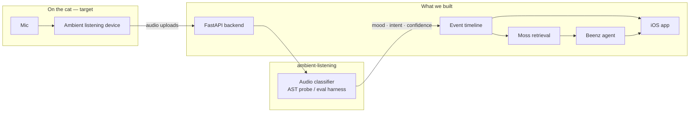

# MeowMeowBeenz

A cat wellness system built around **ambient listening** — a collar or puck on the cat that hears meows and ambient vocalizations, uploads audio to our backend, and turns those moments into a household timeline owners can actually understand.

We built this repo for that end-to-end story. The pieces are here; the live device → classify → event pipeline is the next wire-up. For the demo we run on a synthetic timeline (`data/mockData.json`) so the app, agent, and voice stack work without hardware on stage.

---

## The idea

Cats don't come with a dashboard. Owners notice something feels off long after patterns started — more yowling at night, fewer normal chirps, vocalizations that sound stressed instead of playful.

Our approach:

1. **Listen continuously** — a lightweight device on the cat captures meows and cat vocalizations in context (not just a phone clip when someone happens to be recording).
2. **Classify each moment** — audio becomes structured observations: mood, intent, confidence, risk signals.
3. **Build a timeline** — every observation rolls into a per-cat, per-household history.
4. **Help the owner** — the iOS app surfaces health reports; **Beenz** (text + voice agent) answers questions grounded in what was actually heard.




---

## What we built (and what each part is for)


| Piece                    | Role in the vision                                                                                                                                          | What exists today                                                                                 |
| ------------------------ | ----------------------------------------------------------------------------------------------------------------------------------------------------------- | ------------------------------------------------------------------------------------------------- |
| `**ambient-listening/**` | Data collection + model eval — how we capture cat audio, label it, and pick the classifier the device should run (AST probes, frontier APIs, Meow-Omni MCQ) | Offline eval scripts, datasets, plans                                                             |
| `**backend/**`           | Ingestion API, event store, health rules, Moss-indexed retrieval, Beenz agent, LiveKit voice worker                                                         | FastAPI on `:8000`; events from mock data or MongoDB; clip upload via Gemini as a manual stand-in |
| `**MeowMeowBeenz/**`     | Owner-facing iOS app — household overview, per-cat timeline, health reports, chat with Beenz, voice mode                                                    | SwiftUI client wired to the backend                                                               |
| `**data/mockData.json**` | Realistic demo timeline while the collar pipeline is not live                                                                                               | Synthetic multi-cat household used by Moss, agent, and app                                        |


**Data model:** everything derives from a flat **timeline of events** (one observation = cat + mood + action + confidence + risk signals). Per-cat status, health reports, Moss search, and agent answers all compute from that list — the same list the listening device would feed in production.

---

## Demo vs production path

**Production path (what we're building toward):**

`collar mic → audio chunk upload → classifier (from ambient-listening) → timeline event → Moss + Beenz + iOS`

**Hackathon demo (what runs today):**

`mockData.json (+ optional manual video clip upload) → timeline → Moss + Beenz + iOS`

The product layer is real. The perception layer is researched in `ambient-listening/`. Connecting them — a `POST /api/audio` (or similar) that runs the trained probe and writes an event — is the remaining integration step.

---

## Repo layout

```
MeowMeowBeenz/
├── MeowMeowBeenz/          # iOS app — owner UI, chat, voice, reports
├── backend/                # API, agent, Moss retrieval, voice worker
├── ambient-listening/      # Cat-audio collection + classifier evaluation
├── data/mockData.json      # Demo household timeline
└── run.sh                  # One-command backend startup
```

---

## Quick start

### 1. Configure environment

```bash
cp .env.example .env
# Fill in keys you need (see table below)
```

### 2. Start the backend

```bash
./run.sh
```

API at **[http://localhost:8000](http://localhost:8000)**. Health check: `GET /api/health`.

### 3. Run the iOS app

Open `MeowMeowBeenz/MeowMeowBeenz.xcodeproj` in Xcode, set the backend URL in **Account** (`http://localhost:8000` on simulator; your Mac's LAN IP on device), and run the **MeowMeowBeenz** scheme.

See [MeowMeowBeenz/README.md](MeowMeowBeenz/README.md).

---

## Environment variables

Copy from [.env.example](.env.example).


| Variable                                               | Purpose                                                        |
| ------------------------------------------------------ | -------------------------------------------------------------- |
| `MONGODB_URI`                                          | Optional persistence (Atlas). Without it, mock/in-memory data. |
| `MINIMAX_API_KEY`                                      | Beenz chat + voice reasoning                                   |
| `LIVEKIT_URL`, `LIVEKIT_API_KEY`, `LIVEKIT_API_SECRET` | Voice chat + Inference STT/TTS                                 |
| `MOSS_PROJECT_ID`, `MOSS_PROJECT_KEY`                  | Semantic timeline retrieval for the agent                      |
| `GEMINI_API_KEY`                                       | Optional clip/video analysis (manual upload stand-in)          |
| `START_VOICE_WORKER`                                   | `1` = voice worker always on; `0` = start on demand (default)  |


---

## Backend highlights


| Area                 | Routes                                                       |
| -------------------- | ------------------------------------------------------------ |
| Auth / cats / events | `/api/auth/`*, `/api/cats`, `/api/events`                    |
| Health reports       | `/api/report`                                                |
| Text agent           | `POST /api/agent` — MiniMax + Moss over timeline             |
| Voice                | `POST /api/livekit-token`, `POST /api/livekit-token/stop`    |
| Clip analysis        | `POST /api/analyze-clip` — manual upload → event (demo path) |


Voice setup: [backend/VOICE_SETUP.md](backend/VOICE_SETUP.md)

---

## ambient-listening

This is the **data collection and perception** side of the project — not a separate product, but how we figure out what the collar should hear and how to label it.

- `scripts/` — AST embedding probes, frontier API classifiers, Meow-Omni MCQ harness
- `demo/` — small clip playback demo
- `docs/` — eval plans and reference notes

Large local datasets (`data/`, `outputs/`) are gitignored. See [ambient-listening/README.md](ambient-listening/README.md).

```bash
cd ambient-listening
python scripts/frontier_classify.py   # API-based classification (no GPU)
python scripts/train_probe.py         # AST + logistic regression probe
```

The intended production classifier is the AST linear probe (grouped CV, no recording leakage) — fast enough to run on each uploaded audio chunk at the backend.

---

## Moss + Beenz

Timeline events are indexed in **Moss** for sub-10ms local semantic retrieval. **Beenz** uses that index (text chat + voice `lookup_cat_activity` tool) to answer owner questions like *"how was Luna last night?"* from real observations, not guesses.

Moss preloads when a voice session starts so retrieval stays out of the critical path.

---

## Requirements

- **Python 3.10+** — backend and ambient-listening
- **Xcode** — iOS app
- Optional: LiveKit Cloud, MiniMax, Moss, Gemini, MongoDB Atlas

---

## Project docs

Additional design notes: `[tickets/in-progress/cat-wellness-app/](tickets/in-progress/cat-wellness-app/)`